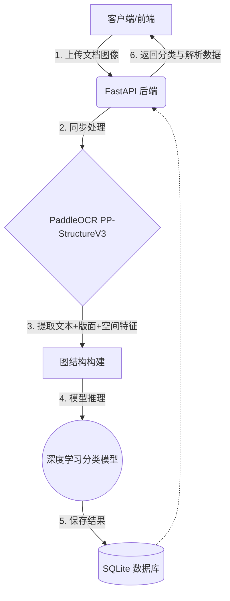

# 系统架构设计文档 (System Architecture Design)

*此文档用于记录系统架构设计与技术决策，随开发持续更新。*

## 1. 整体系统工作流


## 2. 核心模块决策矩阵

| 模块名称 | 技术选型 | 状态 | 备注说明 |
| :--- | :--- | :--- | :--- |
| **API Web 框架** | FastAPI | ✅ 已确认 | 支持异步，自动生成接口文档 |
| **OCR / 版面分析** | PaddleOCR (PP-StructureV3) | ✅ 已确认 | 处理中英文效果好，自带版面分析能力 |
| **文本嵌入** | SentenceTransformer (paraphrase-multilingual-MiniLM-L12-v2) | ✅ 已确认 | 多语言支持，384维输出，将 OCR 文本转为向量 |
| **分类模型** | GCN / GAT / GIN (图神经网络) + CNN (ResNet18) Baseline | ✅ 已确认 | GNN 结合文本语义与空间布局，CNN 作为对比基线 |
| **数据集** | RVL-CDIP (16类文档图像) | ✅ 已确认 | 文档分类领域标准 benchmark，47996张图像 |
| **数据库** | SQLite | ✅ 已确认 | 轻量级本地数据库，无需额外配置 |
| **前端展示** | HTML/CSS/JavaScript | ✅ 已确认 | 简单前端页面，提供上传、分类展示和历史记录 |

## 3. 关键问题与决策记录

- [x] **系统主要面向的具体文档类型是什么？**
  *使用 RVL-CDIP 开源数据集，包含 16 类文档：letter、form、email、handwritten、advertisement、scientific_report、scientific_publication、specification、file_folder、news_article、budget、invoice、presentation、questionnaire、resume、memo。该数据集是文档分类领域的标准 benchmark，便于与现有研究进行公平对比。*

- [x] **深度学习模型的特征输入格式是什么？**
  *多模态特征融合，节点特征包含三部分：(1) SentenceTransformer 文本语义嵌入 (384维)；(2) 归一化空间坐标特征 (4维：相对中心x、相对中心y、相对宽度、相对高度)；(3) OCR 版面类型 one-hot 编码 (10维：text/title/figure/caption/header/footer/table/reference/equation/general)。总维度 398 维。*

- [x] **为什么选择 GNN 而非纯 CNN？**
  *CNN 只能处理像素网格，无法显式建模文档元素之间的结构关系。GNN 将每个文本/表格区域视为节点，通过空间距离构建边，能捕捉文档的布局结构信息。此外，GNN 的图构建策略（节点设计、边构建规则、特征融合方式）可以作为论文的创新点。*

- [x] **对比实验如何设计？**
  *四个模型对比：(1) CNN (ResNet18) — 传统像素级分类 baseline；(2) GCN — 基础图神经网络，邻居平均聚合；(3) GAT — 图注意力网络，注意力加权聚合；(4) GIN — 图同构网络，MLP聚合。此外，还设计了图构建策略消融实验，比较 spatial / reading_order / hybrid 三种边策略对分类性能的影响。所有实验使用相同数据集（RVL-CDIP）和相同的数据划分（80/10/10），确保对比公平。*

- [x] **异步任务架构：手写轻量级脚本 vs Celery？**
  *采用同步处理，简化架构，适合个人毕设开发和演示。*

- [x] **全栈生态语言选择？**
  *采用全 Python 体系（FastAPI + PyTorch/Paddle），在一个进程内完成所有数据流转。*

## 4. 深度学习特征管道 (Feature Pipeline)

1. **原始数据输入**: 用户上传文档图像（PDF/PNG/JPG）。
2. **OCR 特征提取**: PaddleOCR PP-StructureV3 解析图像，提取：
   - 文本区域的文本内容、置信度、坐标框
   - 版面检测结果（title/text/table/figure 等区域类型）
   - 表格区域的 HTML 结构和单元格内容
   - 文档尺寸（宽高）
3. **图结构构建**:
   - **节点**: 每个文本/表格区域为一个节点
   - **节点特征**: 文本嵌入(384维) + 空间特征(4维) + 版面类型(10维) = 398维
   - **边**: 支持多种构建策略（详见消融实验）
     - `spatial`: 空间距离小于文档对角线 15% 的节点对建立无向边（默认）
     - `reading_order`: 按阅读顺序（从上到下、从左到右）连接相邻区域
     - `same_row_col`: 同行或同列的区域全连接（捕捉表格/多栏结构）
     - `hybrid`: 上述三种策略的并集
   - **空间归一化**: 使用文档宽高归一化坐标，适应不同分辨率
4. **GNN 推理**: GCN/GAT 在图上进行消息传递，输出文档类别。

## 5. 模型架构

### 5.1 DocumentGNN (GCN)
```
Input(398) → GCNConv(128) → BatchNorm → ReLU → Dropout(0.5)
           → GCNConv(128) → BatchNorm → ReLU → Dropout(0.5)
           → GCNConv(128) → BatchNorm → ReLU
           → GlobalMeanPool → Linear(16)
```

### 5.2 DocumentGAT (GAT)
```
Input(398) → GATConv(128, heads=4) → BatchNorm → ReLU → Dropout(0.5)
           → GATConv(128, heads=4) → BatchNorm → ReLU → Dropout(0.5)
           → GATConv(128, heads=4) → BatchNorm → ReLU
           → GlobalMeanPool → Linear(16)
```

### 5.3 DocumentGIN (GIN)
```
Input(398) → GINConv(MLP, eps) → BatchNorm → ReLU → Dropout(0.5)
           → GINConv(MLP, eps) → BatchNorm → ReLU → Dropout(0.5)
           → GINConv(MLP, eps) → BatchNorm → ReLU
           → GlobalMeanPool → Linear(16)
```
GIN (Graph Isomorphism Network) 使用 MLP 替代 GCN 的简单线性变换，理论上表达能力最强。

### 5.4 DocumentCNN (ResNet18 Baseline)
```
Input(3×224×224) → ResNet18(预训练) → Linear(16)
```

## 6. 数据集

### RVL-CDIP
- **规模**: 47996 张灰度文档图像，16个类别
- **划分**: 80% 训练 / 10% 验证 / 10% 测试（按类别内随机划分）
- **来源**: [Kaggle - RVL-CDIP Small](https://www.kaggle.com/datasets/uditamin/rvl-cdip-small)
- **预处理**: 通过 `prepare_rvl_cdip.py` 脚本自动完成文件夹重命名（带空格→下划线）和数据划分

## 7. 训练与评估

### 7.1 训练脚本
| 脚本 | 用途 | 命令 |
|---|---|---|
| `train_cnn.py` | CNN 训练 | `python training/scripts/train_cnn.py --dataset rvl_cdip` |
| `train_gnn.py` | GCN/GAT 训练与对比 | `python training/scripts/train_gnn.py --dataset rvl_cdip --model both` |
| `compare_results.py` | 汇总对比结果 | `python training/scripts/compare_results.py` |
| `test_train.py` | 训练流程快速验证（每类2张，2轮） | `python training/scripts/test_train.py` |

常用参数：`--epochs`（训练轮数）、`--batch-size`（批大小）、`--lr`（学习率）、`--patience`（早停耐心值）、`--model gcn|gat|both`（仅 GNN）、`--resume`（断点续训）、`--in-memory`（全量加载到内存，服务器大内存场景）

### 7.2 训练配置
| 参数 | CNN                            | GCN/GAT/GIN                                     |
|---|--------------------------------|-------------------------------------------------|
| Epochs | 50                             | 200                                             |
| Batch Size | 1024                           | 1024                                            |
| Learning Rate | 0.001                          | 0.001                                           |
| 早停 Patience | 10                             | 20                                              |
| 学习率调度 | ReduceLROnPlateau              | ReduceLROnPlateau                               |
| 正则化 | Dropout + weight_decay         | Dropout(0.5) + BatchNorm + weight_decay         |
| DataLoader | num_workers=4, pin_memory=True | pin_memory=True, drop_last=True                 |
| 设备选择 | CUDA > MPS > CPU 自动选择          | CUDA > MPS > CPU 自动选择                           |
| 断点续跑 | 不支持                            | 支持（每轮自动保存 checkpoint，`--resume` 恢复）             |
| 数据加载 | 全量加载                           | 分片按需加载（LRU 缓存），`--in-memory` 可全量加载              |
| 图边策略 | —                              | spatial / reading_order / same_row_col / hybrid |

### 7.3 输出结果
训练完成后自动生成：
- **训练曲线**: Loss/Acc 随 Epoch 变化图
- **混淆矩阵**: 各类别分类结果的热力图（验证集 + 测试集）
- **分类报告**: 每类的 Precision/Recall/F1（验证集 + 测试集）
- **对比表格**: Markdown + LaTeX 格式的三模型对比表（含准确率、F1、参数量、训练时间）
- **模型权重**: `.pth` 格式的最佳模型文件
- **结果摘要**: `result_summary.json`（供对比脚本汇总使用）

## 8. 项目结构
```
backend/
├── core/
│   └── config.py              # 全局配置（数据集、类别定义）
├── models/
│   ├── database/              # SQLAlchemy 数据库模型
│   ├── deep_learning/
│   │   ├── cnn_model.py       # CNN (ResNet18)
│   │   ├── gnn_model.py       # GCN 模型
│   │   └── gat_model.py       # GAT 模型
│   └── schemas/               # Pydantic 数据模型
├── services/
│   ├── ocr_service.py         # PaddleOCR 服务
│   └── classification_service.py  # 分类服务（图构建+推理）
└── ...

training/
├── scripts/
│   ├── train_cnn.py           # CNN 训练脚本
│   ├── train_gnn.py           # GCN/GAT 训练脚本
│   ├── prepare_rvl_cdip.py    # RVL-CDIP 数据预处理
│   ├── compare_results.py     # 对比结果汇总
│   └── test_train.py          # 训练流程快速验证
├── data/
│   └── rvl_cdip/              # RVL-CDIP 数据集
│       ├── train/             # 训练集（按类别分文件夹，~38391张）
│       ├── val/               # 验证集（~4799张）
│       └── test/              # 测试集（~4812张）
├── models/                    # 训练好的模型权重
└── output/                    # 训练输出（图表、报告）
```

## 9. 前端设计

### 9.1 技术栈
- HTML5 + CSS3 + JavaScript (ES6+)
- LocalStorage 本地存储

### 9.2 功能模块
1. **文档上传**: 支持 PDF、图片等格式，文件类型和大小验证
2. **结果展示**: 分类结果（类别、置信度）、OCR 提取内容
3. **历史记录**: 本地存储，按时间倒序显示

## 10. 部署注意事项

### 10.1 AutoDL / 国内服务器
AutoDL 等国内 GPU 服务器可能无法直接访问 HuggingFace，需要设置镜像源：
```bash
export HF_ENDPOINT=https://hf-mirror.com
python training/scripts/train_gnn.py --dataset rvl_cdip --batch-size 1024 --in-memory --model all --edge-strategy all
```

### 10.2 macOS Apple Silicon
- Python 3.12 可能遇到 SSL 证书问题，运行：`/Applications/Python\ 3.12/Install\ Certificates.command`
- 自动支持 MPS 加速（CUDA > MPS > CPU 优先级选择）
- macOS 上 PaddleOCR 可能无法直接处理 `.tif` 格式，代码已自动转为 `.png` 兼容

## 11. 开发原则

- **简化优先**: MVP 先行，避免过度工程化
- **模块化设计**: 清晰的职责分离
- **配置驱动**: 类别定义、数据集配置统一在 `config.py` 中管理
- **可复现性**: 固定随机种子，统一数据划分，确保实验可复现
