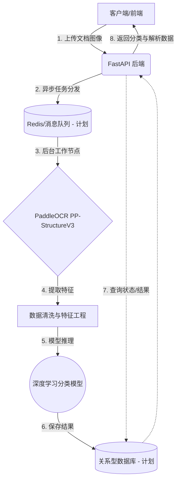

# 系统架构设计文档 (System Architecture Design)

*此文档用于记录我们的头脑风暴结论与架构演进，随讨论持续更新。*

## 1. 整体系统工作流 (Draft)

## 2. 核心模块决策矩阵 (Decision Matrix)

| 模块名称 | 技术选型 | 状态 | 备注说明 |
| :--- | :--- | :--- | :--- |
| **API Web 框架** | FastAPI | ✅ 已确认 | 沿用习惯，支持异步，自动生成接口文档 |
| **OCR / 版面分析** | PaddleOCR (PP-StructureV3) | ✅ 已确认 | 处理中文效果好，自带版面分析能力 |
| **智能分类模型** | 结合文本与坐标位置的轻量级模型 (如 GNN 或轻量级 LayoutLM) | ⏳ 探索中 | 考虑到档案馆文档种类繁多，排版与文字内容并重。首选对硬件要求不过分苛刻的方案。 |
| **数据库** | MySQL / PostgreSQL | ✅ 已确认 | **核心底座**：存储文档元数据与 OCR 结构化特征序列，支撑应用闭环。将部署在云服务器。 |
| **中间件** | Redis + Celery | ✅ 已确认 | **高阶架构设计**：采用业界成熟的分布式任务队列方案。体现系统的高并发处理能力与鲁棒性（重试、监控等），是毕设的重大加分项。 |
| **部署架构 (Cloud-Edge)** | 腾讯云(统筹) + Mac M4(算力) | ✅ 已确认 | **端云协同架构**： 1. 腾讯云 (4C4G)：部署前端、FastAPI 接口层、数据库、消息中间件。 2. MacBook M4：作为“边缘计算节点(Worker)”，监听云端任务队列，下载图片执行计算后回传结果。极大拔高系统架构水平！ |
| **前端展示应用** | Vue 或 React | ⏳ 待定 | 视当前进度与学习意愿决定 |

## 3. 关键问题与调研锚点 (Q&A 追踪)
- [x] **系统主要面向的具体文档类型是什么？** 
  *初步定为：档案馆相关文献（具体门类可能包含公文、信件、表单等多种混合样式，需具备泛化能力）。*
- [x] **深度学习模型的特征输入格式是什么？** 
  *排版样式多样且文字内容均很重要。因此输入特征必须是多模态的：既包含 OCR 提取的纯文本序列语义，也包含文本框的坐标位置（Bounding Box）构成的图结构或空间特征。*
- [x] **期望的模型规模与硬件（GPU）训练条件？** 
  *开发与初期验证环境：MacBook Air M4 (利用统一内存和 MPS 硬件加速)。若能满足毕设要求则直接采用；若算力瓶颈明显，后期考虑租用云端 GPU 服务器。*
- [x] **系统的整体部署方案是什么？** 
  *利用现有的腾讯云 4核4G 服务器部署Web服务、数据库和前端，实现在线可访问。考虑到4G内存跑完整 PaddleOCR 和 GNN 会有些吃力，后续可以在云端配置虚拟内存，或者采用端云协同（云端只负责业务和数据收集，实际模型跑在算力更强的设备中）。*
- [x] **异步任务架构：手写轻量级脚本 vs Celery？**
  *决定采用 **Celery**。虽然手写脚本简单，但使用 Celery 能够体现出“考虑周到的系统设计”。Celery 带来的失败重试、并发控制以及可视化的任务监控面板（Flower），能为毕业论文提供丰富的架构分析素材和好看的 UI 截图，展现出极其成熟的工程思维。*
- [x] **全栈生态语言选择：全 Python 体系 vs Java + Python 混合？**
  *决定采用 **全 Python 体系**。本项目核心难点在于 AI (OCR + 深度学习)。如果贸然引入 Java（Spring Boot）做业务后端，会导致严重的“跨语言通信灾难”（Java 需要通过 HTTP/gRPC 不断与 Python AI 节点传递庞大的图像与张量数据）。使用纯 Python（FastAPI + PyTorch/Paddle）能在一个进程内/同语言生态内完成所有数据流转，极大地降低开发成本，对于个人毕设是唯一合理且优雅的选择。*

## 4. 深度学习与前后端的数据连通机制 (Feature Pipeline)
*此部分解释系统前置模块如何为深度学习模型提供特征支撑。*

1. **原始数据输入**: 用户通过 FastAPI 上传原始文档图像。
2. **特征提取 (OCR)**: PaddleOCR 解析图像，提取出每一个文本块的 **语义信息 (Text)** 与 **空间布局信息 (Bounding Box 坐标)**。
3. **特征持久化**: 将上述提取出的结构化数据严格按照 Pydantic Schema 序列化为 JSON，并存入关系型数据库。
4. **图结构构建 (Graph Construction)**:
   - 深度学习模块 (预处理层) 从数据库读取这些特征。
   - **建图逻辑**: 将每个文本框视为图的**节点 (Node)**；利用坐标计算文本框之间的物理距离，将距离相近的节点连接为**边 (Edge)**。
   - 结合文本内容通过 Word2Vec / BERT 转化为节点向量。
5. **GNN 推理**: 将构建好的图数据送入图神经网络（如 GCN / GAT），由模型捕捉布局与文字的综合特征，并输出最终的文档分类结果（图分类任务）。

## 5. 深度学习模型的核心选型冲突：GNN vs 多模态大模型
*针对档案的复杂版面分类，业界目前有两条主流路线，各有优劣（建议在论文中作为比对对象或对照实验）：*

| 维度 | 图神经网络 (GNN, 如 GCN/GraphSAGE) | 文档多模态大模型 (如 LayoutLMv3, Donut, Qwen-VL) |
| :--- | :--- | :--- |
| **工作原理** | 人工设计规则建图（将文本框视为节点，距离视为边），节点特征由文本向量(Word2Vec/BERT)与坐标构成，通过网络传播特征。 | 端到端或基于 Transformer 架构，原生支持输入文本+坐标(甚至直接输入图像)，利用海量语料自注意力机制学习。 |
| **毕设加分点 (学术性)** | **极高**。建图规则完全由你设计，你可以提出“基于档案布局特性的自适应图构建算法”，很容易画出好看的网络结构图，论文非常有写的。 | **偏低(如果只调包)**。效果通常最好，但常被视为“黑盒”。除非你在微调机制（如 LoRA）或提示词工程上有创新。 |
| **算力要求 (Mac M4)** | **极低**。几万/几十万参数，Mac M4 可以满血全量训练。 | **中到高**。即使是 LayoutLMv3 Base 也有 1.3亿参数，需要较长时间微调；如果是视觉大模型则更吃资源。 |
| **系统建议** | **推荐作为系统的主力分类算法**，由于你是从头搭建 Pipeline，GNN 能完美承接你的 OCR JSON 结构化提取成果。 | **推荐作为 Baseline (基线模型) 对比**。如果精力充沛，可以通过 HuggingFace 跑一个 LayoutLM 作为强对比实验。 |

## 6. 当前开发阶段：后端基础组件搭建
1.  **定义数据模型 (Schema)**: 确立前端与后端、以及 OCR 内部调用的数据流转格式（请求体、响应体格式）。
2.  **封装 OCR 服务 (Service)**: 将已验证的 `PP-StructureV3` 脚本重构为 FastAPI 可调用的核心服务，支持从内存读取图像而不只是从磁盘。
3.  **编写路由接口 (Router)**: 提供文档上传与处理的 API 断点。
