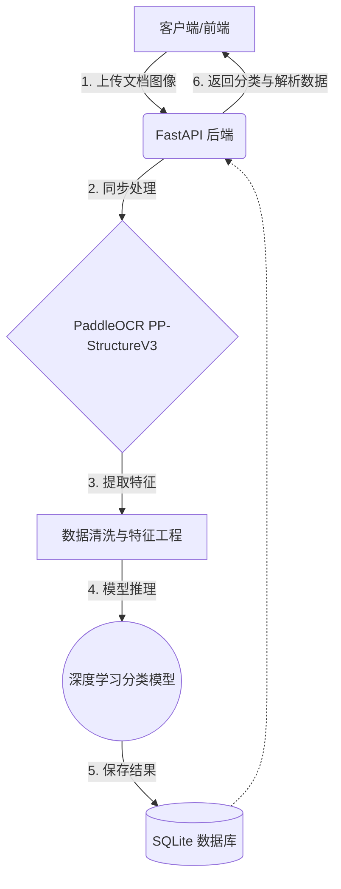

# 系统架构设计文档 (System Architecture Design)

*此文档用于记录我们的头脑风暴结论与架构演进，随讨论持续更新。*

## 1. 整体系统工作流 (简化版)

## 2. 核心模块决策矩阵 (简化版)

| 模块名称 | 技术选型 | 状态 | 备注说明 |
| :--- | :--- | :--- | :--- |
| **API Web 框架** | FastAPI | ✅ 已确认 | 沿用习惯，支持异步，自动生成接口文档 |
| **OCR / 版面分析** | PaddleOCR (PP-StructureV3) | ✅ 已确认 | 处理中文效果好，自带版面分析能力 |
| **智能分类模型** | 轻量级 GNN (图神经网络) | ✅ 已确认 | 结合文本内容与空间布局信息，学术性强，适合毕设论文 |
| **数据库** | SQLite | ✅ 已确认 | 轻量级本地数据库，无需额外配置，适合开发和演示 |
| **中间件** | 无 | ✅ 已确认 | 简化架构，使用同步处理方式，后期可扩展 |
| **部署架构** | 本地开发环境 | ✅ 已确认 | 简化部署，专注核心功能实现 |
| **前端展示应用** | 简单 HTML/JavaScript 前端 | ✅ 已确认 | 独立的前端页面，提供文档上传、分类结果展示和历史记录功能 |

## 3. 关键问题与调研锚点 (Q&A 追踪)
- [x] **系统主要面向的具体文档类型是什么？** 
  *初步定为：档案馆相关文献（具体门类可能包含公文、信件、表单等多种混合样式，需具备泛化能力）。*
- [x] **深度学习模型的特征输入格式是什么？** 
  *排版样式多样且文字内容均很重要。因此输入特征必须是多模态的：既包含 OCR 提取的纯文本序列语义，也包含文本框的坐标位置（Bounding Box）构成的图结构或空间特征。*
- [x] **期望的模型规模与硬件（GPU）训练条件？** 
  *开发与初期验证环境：MacBook Air M4 (利用统一内存和 MPS 硬件加速)。若能满足毕设要求则直接采用；若算力瓶颈明显，后期考虑租用云端 GPU 服务器。*
- [x] **系统的整体部署方案是什么？** 
  *采用本地开发环境部署，使用 SQLite 作为数据库，利用 FastAPI 内置的 Swagger UI 作为前端界面，简化部署流程，专注核心功能实现。*
- [x] **异步任务架构：手写轻量级脚本 vs Celery？**
  *决定采用 **同步处理**。简化架构，减少复杂性，适合个人毕设开发和演示。*
- [x] **全栈生态语言选择：全 Python 体系 vs Java + Python 混合？**
  *决定采用 **全 Python 体系**。本项目核心难点在于 AI (OCR + 深度学习)。使用纯 Python（FastAPI + PyTorch/Paddle）能在一个进程内/同语言生态内完成所有数据流转，极大地降低开发成本，对于个人毕设是唯一合理且优雅的选择。*

## 4. 深度学习与前后端的数据连通机制 (Feature Pipeline)
*此部分解释系统前置模块如何为深度学习模型提供特征支撑。*

1. **原始数据输入**: 用户通过 FastAPI 上传原始文档图像。
2. **特征提取 (OCR)**: PaddleOCR 解析图像，提取出每一个文本块的 **语义信息 (Text)** 与 **空间布局信息 (Bounding Box 坐标)**。
3. **特征持久化**: 将上述提取出的结构化数据严格按照 Pydantic Schema 序列化为 JSON，并存入关系型数据库。
4. **图结构构建 (Graph Construction)**:
   - 深度学习模块 (预处理层) 从数据库读取这些特征。
   - **建图逻辑**: 将每个文本框视为图的**节点 (Node)**；利用坐标计算文本框之间的物理距离，将距离相近的节点连接为**边 (Edge)**。
   - 结合文本内容通过 Word2Vec / BERT 转化为节点向量。
5. **GNN 推理**: 将构建好的图数据送入图神经网络（如 GCN / GAT），由模型捕捉布局与文字的综合特征，并输出最终的文档分类结果（图分类任务）。

## 5. 深度学习模型的核心选型冲突：GNN vs 多模态大模型
*针对档案的复杂版面分类，业界目前有两条主流路线，各有优劣（建议在论文中作为比对对象或对照实验）：*

| 维度 | 图神经网络 (GNN, 如 GCN/GraphSAGE) | 文档多模态大模型 (如 LayoutLMv3, Donut, Qwen-VL) |
| :--- | :--- | :--- |
| **工作原理** | 人工设计规则建图（将文本框视为节点，距离视为边），节点特征由文本向量(Word2Vec/BERT)与坐标构成，通过网络传播特征。 | 端到端或基于 Transformer 架构，原生支持输入文本+坐标(甚至直接输入图像)，利用海量语料自注意力机制学习。 |
| **毕设加分点 (学术性)** | **极高**。建图规则完全由你设计，你可以提出“基于档案布局特性的自适应图构建算法”，很容易画出好看的网络结构图，论文非常有写的。 | **偏低(如果只调包)**。效果通常最好，但常被视为“黑盒”。除非你在微调机制（如 LoRA）或提示词工程上有创新。 |
| **算力要求 (Mac M4)** | **极低**。几万/几十万参数，Mac M4 可以满血全量训练。 | **中到高**。即使是 LayoutLMv3 Base 也有 1.3亿参数，需要较长时间微调；如果是视觉大模型则更吃资源。 |
| **系统建议** | **推荐作为系统的主力分类算法**，由于你是从头搭建 Pipeline，GNN 能完美承接你的 OCR JSON 结构化提取成果。 | **推荐作为 Baseline (基线模型) 对比**。如果精力充沛，可以通过 HuggingFace 跑一个 LayoutLM 作为强对比实验。 |

## 6. 当前开发阶段：后端基础组件搭建
1.  **定义数据模型 (Schema)**: 确立前端与后端、以及 OCR 内部调用的数据流转格式（请求体、响应体格式）。
2.  **封装 OCR 服务 (Service)**: 将已验证的 `PP-StructureV3` 脚本重构为 FastAPI 可调用的核心服务，支持从内存读取图像而不只是从磁盘。
3.  **编写路由接口 (Router)**: 提供文档上传与处理的 API 端点。
4.  **实现 GNN 分类模型**: 构建基于文本和空间特征的图神经网络模型。
5.  **集成 SQLite 数据库**: 存储文档元数据和 OCR 结果。
6.  **前端界面开发**: 实现文档上传、结果展示和历史记录功能。

## 8. 前端设计

### 8.1 技术栈
- **HTML5**: 页面结构
- **CSS3**: 样式设计
- **JavaScript (ES6+)**: 交互逻辑
- **LocalStorage**: 本地存储历史记录

### 8.2 功能模块
1. **文档上传模块**:
   - 支持 PDF、图片等多种格式
   - 实时上传状态显示
   - 文件类型和大小验证

2. **结果展示模块**:
   - 分类结果显示（类别、置信度）
   - OCR 提取内容展示
   - 结构化数据可视化

3. **历史记录模块**:
   - 本地存储历史分类记录
   - 按时间倒序显示
   - 支持查看历史详情

### 8.3 界面设计
- **响应式布局**: 适配不同屏幕尺寸
- **现代化风格**: 简洁、专业的设计
- **交互反馈**: 实时状态更新和错误提示
- **用户友好**: 直观的操作流程

### 8.4 数据流
1. **前端到后端**: 文件上传 → API 调用
2. **后端到前端**: 分类结果 → 界面展示
3. **本地存储**: 历史记录 → LocalStorage

## 9. 开发原则

### 9.1 简化优先原则
- **最小可行产品 (MVP)**: 先实现核心功能，再考虑扩展
- **避免过度工程化**: 不引入不必要的复杂性
- **渐进式开发**: 从简单到复杂，逐步迭代

### 9.2 代码质量原则
- **模块化设计**: 清晰的职责分离，便于维护和测试
- **类型提示**: 使用 Python 类型注解，提高代码可读性和IDE支持
- **错误处理**: 完善的异常处理机制
- **代码风格**: 遵循 PEP 8 编码规范，使用 Black 格式化

### 9.3 开发流程原则
- **测试驱动开发**: 先写测试，再实现功能
- **版本控制**: 合理的 git 提交规范
- **文档先行**: 保持设计文档与代码同步
- **持续集成**: 定期运行测试和类型检查

### 9.4 性能与资源原则
- **内存管理**: 合理处理大型文件和模型
- **计算优化**: 利用硬件加速（如 MPS）
- **资源限制**: 考虑部署环境的资源约束

### 9.5 可扩展性原则
- **接口设计**: 预留扩展点，便于未来功能添加
- **配置管理**: 使用环境变量和配置文件，支持不同环境
- **插件架构**: 核心功能模块化，支持插件扩展
